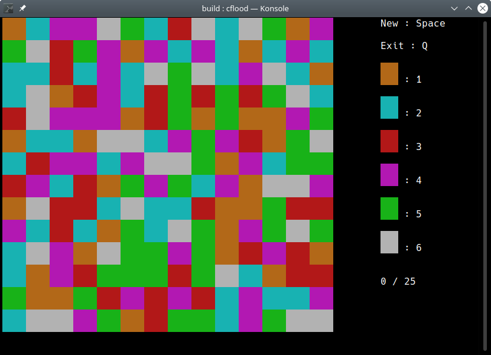

# Curses Flood (cflood)
Ncurses flood-it clone.



## Prerequisites
You need a C++ compiler, CMake, make and the ncurses library and headers.

### debian / ubuntu
```
sudo apt install build-essential cmake libncurses-dev
```

### openSUSE
```
sudo zypper install -t pattern devel_basis
sudo zypper install cmake ncurses-devel
```

## Build and install
```
mkdir build
cd build
cmake ../ -DCMAKE_BUILD_TYPE=Release
make

sudo make install
```
## Usage
To choose a color with the mouse you can either click colors in the game
board or in the menu. To choose a color with the keyboard type the number
that is displayed next to the color.
